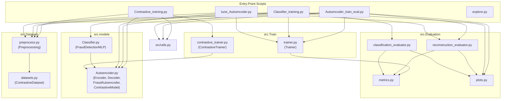

# Credit Card Fraud Detection

A deep learning pipeline for detecting fraudulent credit card transactions,
combining **contrastive pre-training**, **autoencoder-based anomaly detection**,
and **supervised classification** on the
[Kaggle Credit Card Fraud Detection](https://www.kaggle.com/datasets/mlg-ulb/creditcardfraud) dataset.

## Authors

| Name | Email |
|------|-------|
| Andreacchio Pasquale | pasquale.andreacchio@studenti.unipd.it |
| Calcagni Matteo Renato | matteorenato.calcagni@studenti.unipd.it |
| Lavarda Nicola | nicola.lavarda.1@studenti.unipd.it |

---

## Project Goal

Credit card fraud is extremely rare (~0.17 % of transactions), making it a
challenging class-imbalance problem.  This project tackles it with a
**three-stage deep learning pipeline**:

1. **Contrastive Pre-training** — An encoder backbone learns to separate
   normal from fraudulent transactions in a metric space using triplet loss,
   *before* any task-specific head is attached.
2. **Autoencoder Anomaly Detection** — The pre-trained encoder is paired with
   a decoder and trained to reconstruct *normal* transactions only; at
   inference time, high reconstruction error flags fraud.
3. **Supervised Classification** — The same pre-trained encoder feeds a
   classifier head (MLP) trained with SMOTE-balanced data and
   BCEWithLogitsLoss.

A separate **hyperparameter tuning** script uses
[Optuna](https://optuna.org/) to search over architecture and training
parameters, optimising validation AUPRC.

---

## Repository Structure

```
CreditCard_FraudDetection/
├── configs/                          # YAML configuration files
│   ├── config.yaml                   #   Autoencoder & contrastive settings
│   └── classification_config.yaml    #   Classifier settings
│
├── data/                             # Dataset directory (git-ignored)
│   └── creditcard.csv                #   Raw Kaggle dataset
│
├── src/                              # Reusable library code
│   ├── __init__.py                   #   Package docstring & author metadata
│   ├── utils.py                      #   Config loading, seeding, device, logging
│   │
│   ├── Datasets/                     #   Data loading & preprocessing
│   │   ├── __init__.py
│   │   ├── preprocess.py             #     Preprocessing pipeline (split, scale, SMOTE)
│   │   └── datasets.py              #     ContrastiveDataset (triplet sampling)
│   │
│   ├── models/                       #   Neural network architectures
│   │   ├── __init__.py
│   │   ├── Autoencoder.py            #     Encoder, Decoder, FraudAutoencoder,
│   │   │                             #     ContrastiveModel, ContrastiveHead
│   │   └── Classifier.py            #     FraudDetectionMLP
│   │
│   ├── Train/                        #   Training orchestration
│   │   ├── __init__.py
│   │   ├── trainer.py                #     Trainer (reconstruction + classification)
│   │   └── contrastive_trainer.py   #     ContrastiveTrainer (triplet loss)
│   │
│   └── Evaluation/                   #   Evaluation & reporting
│       ├── __init__.py
│       ├── metrics.py                #     Centralised metrics (F1, AUPRC, MCC, ...)
│       ├── plots.py                  #     Diagnostic plots (PR curve, ROC, CM, ...)
│       ├── reconstruction_evaluator.py  # ReconstructionEvaluator
│       ├── classification_evaluator.py  # ClassificationEvaluator
│       └── evaluation_utils.py       #     NumpyEncoder for JSON serialisation
│
├── Contrastive_training.py           # Entry point: contrastive pre-training
├── Autoencoder_train_eval.py         # Entry point: autoencoder train & evaluate
├── Classifier_training.py            # Entry point: classifier train & evaluate
├── tune_Autoencoder.py               # Entry point: Optuna hyperparameter tuning
├── explore.py                        # Exploratory data analysis & visualisation
│
├── checkpoints/                      # Saved model checkpoints (git-ignored)
├── logs/                             # Training logs & history plots
├── plots/                            # Evaluation diagnostic plots
├── results/                          # Evaluation metrics (JSON)
├── requirements.txt                  # Python dependencies
└── .gitignore
```

### How the Files Connect

The diagram below shows the dependency flow between the main components.
Entry-point scripts (top) call into the `src` library (bottom); arrows
indicate "uses / imports".



---

## Pipeline Overview

### Stage 1 — Contrastive Pre-training

```
Contrastive_training.py
  └─→ Preprocessing.get_contrastive_dataset()
        └─→ ContrastiveDataset (anchor / positive / negative triplets)
  └─→ ContrastiveModel (Encoder backbone + projection head)
  └─→ ContrastiveTrainer.fit()  →  saves backbone weights (.pth)
```

The encoder backbone learns a metric space where normal transactions cluster
together and fraud transactions are pushed apart, using
`TripletMarginLoss`.  After training, only the backbone encoder weights are
saved — the projection head is discarded.

### Stage 2 — Autoencoder Anomaly Detection

```
Autoencoder_train_eval.py
  └─→ Preprocessing.get_dataset(autoencoder=True)  →  normal-only train set
  └─→ FraudAutoencoder (Encoder + Decoder)
        └─→ optionally loads pre-trained encoder weights
  └─→ Trainer.fit()  →  checkpoints best model (on val AUPRC)
  └─→ ReconstructionEvaluator.evaluate()  →  metrics + plots
```

Trained only on normal transactions; at inference time, fraud transactions
produce high reconstruction error and are flagged as anomalies.

### Stage 3 — Supervised Classification

```
Classifier_training.py
  └─→ Preprocessing.get_smote_dataset()  →  SMOTE-balanced train set
  └─→ FraudDetectionMLP (Encoder + classification head)
        └─→ optionally loads pre-trained encoder weights
  └─→ Trainer.fit()  →  checkpoints best model (on val F1)
  └─→ ClassificationEvaluator.evaluate()  →  metrics + plots
```

Directly predicts fraud probability.  The encoder can be frozen to leverage
contrastive pre-training, or trained end-to-end.

### Hyperparameter Tuning

```
tune_Autoencoder.py
  └─→ Optuna study (TPE sampler)
        └─→ per trial: contrastive pre-training + reconstruction training
  └─→ saves best config to YAML
```

---

## Setup

### Requirements

- Python ≥ 3.10
- Dependencies listed in `requirements.txt`

```bash
# Create virtual environment
python -m venv .venv
source .venv/bin/activate   # Linux/macOS

# Install dependencies
pip install -r requirements.txt
```

### Dataset

Download `creditcard.csv` from
[Kaggle](https://www.kaggle.com/datasets/mlg-ulb/creditcardfraud) and place
it in the `data/` directory.

---

## Usage

All scripts accept `--config` to override the default configuration file
and the training scripts accept `--eval_only` to skip training and evaluate
a saved checkpoint.

```bash
# 1. (Optional) Exploratory data analysis
python explore.py

# 2. Contrastive pre-training
python Contrastive_training.py

# 3a. Autoencoder training & evaluation
python Autoencoder_train_eval.py

# 3b. Supervised classifier training & evaluation
python Classifier_training.py

# 4. (Optional) Hyperparameter tuning
python tune_Autoencoder.py --n_trials 30 --epochs_per_trial 50
```

### Configuration

All hyperparameters are controlled via YAML files in `configs/`:

| File | Controls |
|------|----------|
| `config.yaml` | Autoencoder architecture, training, contrastive settings, anomaly thresholds |
| `classification_config.yaml` | Classifier training, SMOTE, threshold method |

The classifier config references `config.yaml` via `base_model_config` to
ensure the encoder architecture is always consistent across all stages.

---

## Evaluation Outputs

Each evaluation generates:

- **Metrics** — Precision, Recall, F1, F2, MCC, Cohen's Kappa, Balanced
  Accuracy, AUPRC, AUROC (saved as JSON in `results/`)
- **Diagnostic Plots** — Confusion matrix, Precision-Recall curve, ROC curve,
  F1 vs Threshold, score distribution (saved in `plots/`)
- **Training History** — Loss, validation metrics, and learning rate curves
  (saved in `logs/`)
