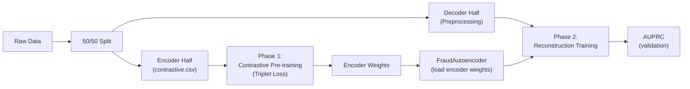

# Walkthrough — Optuna Tuning for FFNN Autoencoder

## What Was Created

### [tune_Autoencoder.py](file:///home/matteocalcagni/Desktop/CreditCard_FraudDetection/tune_Autoencoder.py)

A standalone Optuna hyperparameter tuning script for the `FraudAutoencoder` with **contrastive encoder pre-training**, following the same conventions as [tune_LSTM.py](file:///home/matteocalcagni/Desktop/CreditCard_FraudDetection/tune_LSTM.py) and [Contrastive_training.py](file:///home/matteocalcagni/Desktop/CreditCard_FraudDetection/Contrastive_training.py).

## Two-Phase Training Pipeline

Each trial runs a two-phase pipeline:



### Phase 1 — Contrastive Encoder Pre-training
- Builds a `ContrastiveModel` (Encoder backbone + projection head) with the trial's `hidden_dims`
- Trains with `TripletMarginLoss` on anchor/positive/negative triplets from the encoder half
- Extracts and returns the backbone's `state_dict` (projection head is discarded)
- Fixed hyperparameters: `lr=1e-3`, `margin=1.0`, `epochs=20` (configurable via `--contrastive_epochs`)

### Phase 2 — Reconstruction Training
- Builds a `FraudAutoencoder` and **loads the pre-trained encoder weights** into `model.encoder`
- The decoder starts from scratch
- Trains on the decoder half (normal-only) with the trial's reconstruction hyperparameters
- AUPRC checkpointing on the validation set

## Data Split

Following [Contrastive_training.py](file:///home/matteocalcagni/Desktop/CreditCard_FraudDetection/Contrastive_training.py), the raw dataset is split **50/50** once at startup:
- **Encoder half** → saved to `data/contrastive.csv` for `ContrastiveDataset` (triplet mining)
- **Decoder half** → wrapped in `Preprocessing` for `get_dataset(autoencoder=True, val_size=0.15)`

## Tuned Hyperparameters

### Architecture
| Parameter | Search space |
|---|---|
| `num_layers` | 2, 3, 4 |
| `hidden_dim_1` | 20, 24, 28 |
| `hidden_dim_2` | 12, 14, 16, 18 |
| `hidden_dim_3` | 6, 8, 10, 12 (if ≥ 3 layers) |
| `hidden_dim_4` | 3, 4, 6 (if 4 layers) |

Monotonic decrease is enforced — trials violating it are pruned.

### Training (reconstruction phase)
| Parameter | Search space |
|---|---|
| `loss` | mse, mae, huber |
| `learning_rate` | 1e-4 – 1e-2 (log) |
| `weight_decay` | 1e-6 – 1e-3 (log) |
| `batch_size` | 256, 512, 1024 |
| `optimizer` | adam, adamw |

## Smoke Test

```bash
python tune_Autoencoder.py --n_trials 1 --epochs_per_trial 2 --contrastive_epochs 2
```

**Result**: ✅ Passed

Key log output confirming the two-phase flow:
```
Splitting raw dataset 50/50 (encoder / decoder)...
Encoder half: 142403 samples saved to data/contrastive.csv
Decoder half: 142404 samples for reconstruction
Trial 0 — Contrastive pre-training (hidden_dims=[20, 18, 12])...
  [Contrastive] Epoch  1/2  |  triplet_loss=0.03389146
  [Contrastive] Epoch  2/2  |  triplet_loss=0.00007839
  Loaded contrastive pre-trained encoder weights.
Epoch   1/2  |  train_loss=1.075  |  val_loss=1.015  |  val_auprc=0.0590
Epoch   2/2  |  train_loss=0.996  |  val_loss=0.954  |  val_auprc=0.1193
Best Trial AUPRC Score: 0.1193
```

## Usage

```bash
# Full run with defaults (15 trials × 20 contrastive + 30 reconstruction epochs)
python tune_Autoencoder.py

# Custom run
python tune_Autoencoder.py \
  --config configs/config.yaml \
  --n_trials 25 \
  --contrastive_epochs 15 \
  --epochs_per_trial 50 \
  --output_config configs/config_best.yaml
```

> [!NOTE]
> After tuning, the script overwrites `config.yaml` with the best parameters (same as `tune_LSTM.py`). Restored via `git checkout configs/config.yaml` after the smoke test.
